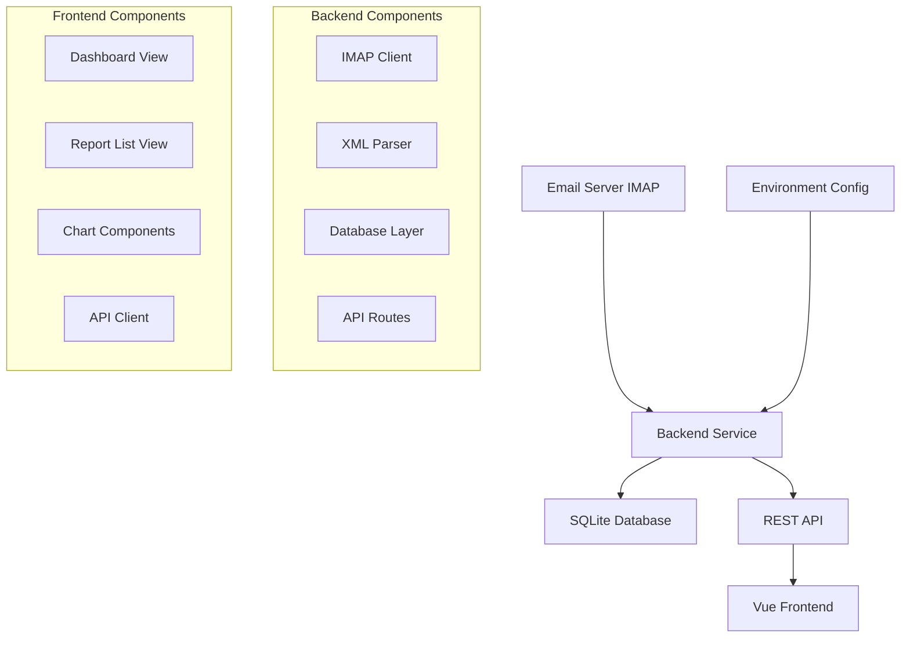

# Design Document

## Overview

The DMARC Report Viewer is a full-stack application consisting of a Node.js backend with Express and Prisma, and a Vue 3 frontend with TypeScript and Tailwind CSS. The system follows a clean architecture pattern with clear separation between data access, business logic, and presentation layers.

## Architecture

### System Architecture



### Technology Stack

**Backend:**
- Runtime: Node.js with ESM modules
- Framework: Express.js for REST API
- Database: SQLite with Prisma ORM
- Email: node-imap for IMAP connectivity
- Parsing: mailparser for email parsing, xml2js for XML processing
- Configuration: dotenv for environment variables

**Frontend:**
- Framework: Vue 3 with Composition API
- Language: TypeScript for type safety
- Build Tool: Vite for fast development and building
- Styling: Tailwind CSS for utility-first styling
- Charts: Chart.js or similar for data visualization

## Components and Interfaces

### Backend Components

#### IMAP Client (`src/imapClient.ts`)
- **Purpose**: Handles email server connection and message retrieval
- **Key Methods**:
  - `connect()`: Establish IMAP connection
  - `fetchUnreadMessages()`: Get unread emails with DMARC attachments
  - `markAsRead(messageId)`: Mark processed emails as read
  - `downloadAttachment(messageId, attachmentId)`: Download XML files

#### XML Parser (`src/parseDmarc.ts`)
- **Purpose**: Processes DMARC XML reports and extracts structured data
- **Key Methods**:
  - `parseXmlReport(xmlContent)`: Parse XML to structured data
  - `extractMetadata(parsedXml)`: Extract report metadata
  - `extractRecords(parsedXml)`: Extract individual DMARC records

#### Database Layer (`src/db/prisma.ts`)
- **Purpose**: Database operations and data persistence
- **Key Methods**:
  - `saveReport(reportData)`: Store parsed report data
  - `getReports(filters?)`: Retrieve reports with optional filtering
  - `getReportById(id)`: Get specific report details
  - `getSummaryStats()`: Calculate aggregated statistics

#### API Routes
- **Reports Route** (`src/routes/reports.ts`): CRUD operations for reports
- **Summary Route** (`src/routes/summary.ts`): Aggregated statistics endpoint

### Frontend Components

#### Dashboard View (`src/views/DashboardView.vue`)
- **Purpose**: Display high-level statistics and trends
- **Features**: Summary cards, charts, key metrics

#### Report List View (`src/views/ReportListView.vue`)
- **Purpose**: Tabular display of all reports with sorting and filtering
- **Features**: Sortable columns, pagination, detailed view navigation

#### Summary Card (`src/components/SummaryCard.vue`)
- **Purpose**: Reusable component for displaying key metrics
- **Props**: title, value, icon, trend indicator

#### Chart View (`src/components/ChartView.vue`)
- **Purpose**: Reusable chart component for various data visualizations
- **Props**: chartType, data, options

#### API Client (`src/api/reports.ts`)
- **Purpose**: Frontend service for backend communication
- **Methods**: fetchReports(), fetchSummary(), fetchReportById()

## Data Models

### Database Schema (Prisma)

```prisma
model Report {
  id              String   @id @default(cuid())
  domain          String
  reportId        String   @unique
  orgName         String
  email           String
  startDate       DateTime
  endDate         DateTime
  createdAt       DateTime @default(now())
  updatedAt       DateTime @updatedAt
  
  records         Record[]
  
  @@map("reports")
}

model Record {
  id              String   @id @default(cuid())
  reportId        String
  sourceIp        String
  count           Int
  disposition     String
  dkim            String
  spf             String
  headerFrom      String
  
  report          Report   @relation(fields: [reportId], references: [id])
  
  @@map("records")
}
```

### API Response Models

```typescript
interface ReportSummary {
  id: string;
  domain: string;
  orgName: string;
  startDate: string;
  endDate: string;
  totalMessages: number;
  spfPassRate: number;
  dkimPassRate: number;
  policyAction: string;
}

interface DetailedReport extends ReportSummary {
  records: Array<{
    sourceIp: string;
    count: number;
    disposition: string;
    dkim: string;
    spf: string;
    headerFrom: string;
  }>;
}

interface DashboardStats {
  totalReports: number;
  totalMessages: number;
  avgSpfPassRate: number;
  avgDkimPassRate: number;
  policyDistribution: {
    none: number;
    quarantine: number;
    reject: number;
  };
  trendsData: Array<{
    date: string;
    messageCount: number;
    failureRate: number;
  }>;
}
```

## Error Handling

### Backend Error Handling
- **IMAP Connection Errors**: Retry with exponential backoff, log failures
- **XML Parsing Errors**: Skip malformed reports, log parsing issues
- **Database Errors**: Transaction rollback, proper error responses
- **API Errors**: Standardized error response format with appropriate HTTP status codes

### Frontend Error Handling
- **API Request Failures**: Display user-friendly error messages
- **Loading States**: Show spinners and skeleton screens
- **Empty States**: Appropriate messaging when no data is available
- **Network Issues**: Retry mechanisms and offline indicators

### Error Response Format
```typescript
interface ErrorResponse {
  error: {
    code: string;
    message: string;
    details?: any;
  };
  timestamp: string;
  path: string;
}
```

## Testing Strategy

### Backend Testing
- **Unit Tests**: Individual functions for parsing, database operations
- **Integration Tests**: API endpoints with test database
- **IMAP Tests**: Mock IMAP server for email fetching scenarios
- **Database Tests**: Prisma operations with test SQLite database

### Frontend Testing
- **Component Tests**: Vue components with Vue Test Utils
- **API Integration Tests**: Mock API responses for frontend logic
- **E2E Tests**: Critical user flows with Playwright or Cypress
- **Visual Tests**: Component rendering and responsive design

### Test Data
- **Sample DMARC XML**: Various report formats from different providers
- **Mock Email Messages**: Test IMAP functionality without real email server
- **Database Fixtures**: Consistent test data for API and frontend tests

## Security Considerations

### Backend Security
- **Environment Variables**: Sensitive credentials stored securely
- **Input Validation**: Sanitize all user inputs and API parameters
- **SQL Injection Prevention**: Prisma ORM provides built-in protection
- **Rate Limiting**: Prevent API abuse with request throttling

### Frontend Security
- **XSS Prevention**: Proper data sanitization in Vue templates
- **CSRF Protection**: API token validation for state-changing operations
- **Content Security Policy**: Restrict resource loading and script execution

## Performance Considerations

### Backend Performance
- **Database Indexing**: Optimize queries with proper indexes on frequently searched fields
- **Batch Processing**: Process multiple DMARC reports in batches
- **Connection Pooling**: Efficient database connection management
- **Caching**: Cache frequently accessed summary statistics

### Frontend Performance
- **Code Splitting**: Lazy load routes and components
- **Data Pagination**: Limit large datasets with server-side pagination
- **Chart Optimization**: Efficient rendering for large datasets
- **Bundle Optimization**: Tree shaking and minification with Vite